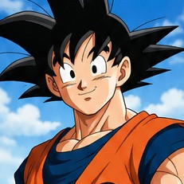

# Son Gokuren CV digitala

## 1. Proiektuaren deskribapena

Proiektu honetan Son Gokuren curriculum vitae digital bat sortu dut, **HTML eta CSS** erabiliz.

Webgunea bi zati nagusitan banatuta dago:

* Alboko barra, datu pertsonalekin, gaitasunekin, teknika nagusiekin, hizkuntzekin eta esaldi batekin.
* Eduki nagusia, profil profesionalarekin, esperientziarekin, prestakuntzarekin, lorpenekin eta borroka nabarmenekin.

Proiektuaren helburua HTML eta CSS erabiliz web orri bat sortzea eta informazioa modu antolatuan erakustea da.


## 2. HTMLaren egitura

HTML dokumentua batez ere `aside` eta `main` elementuetan banatuta dago.

`<aside>` elementuan bigarren mailako informazioa dago:

* Son Gokuren argazkia.
* Datu pertsonalak.
* Gaitasunak.
* Teknika nagusiak.
* Hizkuntzak.
* Esaldi bat.

`<main>` elementuak curriculumaren informazio nagusia dauka:

* Goiburua.
* Profil profesionala.
* Lan-esperientzia.
* Prestakuntza eta entrenamendua.
* Lorpenak.
* Teknikak eta transformazioak.
* Borroka nabarmenak.
* Orri-oina.

Adibidez, datu pertsonalak `div` desberdinen bidez antolatu ditut:

```html
<div class="data-item">
  <span class="label">UBICACIÓN</span>
  <p class="label-value">Monte Paoz, Tierra</p>
</div>
```

HTML elementu semantikoak ere erabili ditut, hala nola:

```html
<header>
<main>
<aside>
<section>
<article>
<footer>
<table>
```

## 3. Goiburua eta CSSaren diseinua

Goiburuan `header-card` klasea erabiltzen da. Bertan Son Gokuren izena, lanbidea, kokapena eta eskuragarritasuna agertzen dira.

Goiburuan atzeko irudi bat ere erabiltzen da:

```css
.header-card {
  background-image:
    linear-gradient(rgba(50, 98, 160, 0.1), rgba(50, 98, 160, 0.1)),
    url("../mountain.png");
}
```

CSSaren barruan `:root` erabili dut koloreak, tamainak eta beste balio batzuk aldagaietan gordetzeko:

```css
:root {
  --color-primary: #0a3663;
  --color-secondary: #0066cc;
  --color-bg-body: #eef2f5;
}
```

Ondoren, aldagai horiek CSSko beste ataletan erabiltzen ditut:

```css
color: var(--color-primary);
```

Horrela, diseinuko balioak errazago aldatu daitezke.


## 4. Grid eta diseinu responsive-a

Orriko elementuak antolatzeko **CSS Grid** erabili dut.

Edukiontzi nagusia:

```css
.cv-container {
  display: grid;
  grid-template-columns: 1fr;
}
```

Pantaila handietan bi zutabe erabiltzen dira:

```css
@media (min-width: 900px) {
  .cv-container {
    grid-template-columns: 350px 1fr;
  }
}
```

Horrela, alboko barrak 350px-ko zabalera dauka eta eduki nagusiak geratzen den espazioa hartzen du.

Beste atal batzuetan ere `grid` erabiltzen dut, adibidez esperientzian:

```css
.experience-grid {
  display: grid;
  grid-template-columns: 1fr;
  gap: var(--spacing-md);
}
```

Eta prestakuntzan:

```css
.training-grid {
  display: grid;
  grid-template-columns: repeat(auto-fit, minmax(150px, 1fr));
}
```

Pantaila txikietarako beste `@media` bat erabiltzen dut:

```css
@media (max-width: 420px) {
  .header h1 {
    font-size: var(--font-xl);
  }
}
```

Horrela, webgunea pantaila tamaina desberdinetara egokitzen da.


## 5. Txartelak, gaitasunak eta teknikak

Informazioaren atal desberdinak banatzeko `.card` klasea erabiltzen dut:

```css
.card {
  background-color: var(--color-bg-card);
  border-radius: var(--radius-card);
  padding: var(--spacing-md);
  box-shadow: 0 4px 6px rgba(255, 24, 24);
}
```

Txartelek atzeko kolorea, ertz biribilduak, barruko tartea eta itzala dituzte.

Gaitasunak aurrerapen-barren bidez erakusten dira:

```html
<div class="progress-fill level-5"></div>
```

`level-5` mailak barra %100 betetzen du:

```css
.level-5 {
  width: 100%;
}
```

`level-4` mailak %80 betetzen du:

```css
.level-4 {
  width: 80%;
}
```

Teknikak etiketa txikien bidez erakusten dira, `.tag` klasearekin:

```css
.tag {
  border: 1px solid rgb(165, 165, 240);
  padding: 4px 12px;
  border-radius: var(--radius-pill);
}
```

Erabilitako teknika batzuk Kamehameha, Genkidama, Kaio-ken, Shunkan Idō, Ultra Instinct eta Super Saiyan dira.


## 6. Esperientzia, prestakuntza eta lorpenak

Lan-esperientzia txartel desberdinetan banatuta dago.

Hiru esperientzia gehitu ditut:

* Lurraren defendatzailea.
* Saiyan gerlaria.
* Tenkaichi Budokaiko lehiakidea.

Prestakuntza ere txartelen bidez antolatu dut:

1. Maisu Roshi.
2. Korin.
3. Iparraldeko Kaio.
4. Whis.

Lorpen nabarmenen artean honako hauek daude:

* 23. Tenkaichi Budokaiko txapelduna.
* Super Saiyan lehenengo transformazioa.
* Lurraren defentsa hainbat alditan.
* Boterearen Txapelketan parte hartzea.
* Ultra Instinct menperatzea.
* Majin Buu-ren aurkako garaipena.

Lorpenak eta teknikak `summary-grid` edukiontziaren barruan antolatzen dira:

```css
.summary-grid {
  display: grid;
  grid-template-columns: 1fr;
  gap: var(--spacing-lg);
}
```

Pantaila handietan bi atalak bata bestearen ondoan agertzen dira.


## 7. Borroken taula eta koloreak

HTML taula bat sortu dut Son Gokuren borroka desberdinak erakusteko.

Taulak hiru zutabe ditu:

* Aurkaria.
* Emaitza.
* Testuingurua.

Adibidez:

```html
<tr>
  <td>Piccolo Jr</td>
  <td><span class="green-color">Victoria</span></td>
  <td>23.º Tenkaichi Budokai</td>
</tr>
```

Emaitzak kolore desberdinekin erakusten dira:

```css
.green-color {
  color: green;
}

.red-color {
  color: red;
}

.yellow-color {
  color: rgb(222, 177, 44);
}
```

* Berdea: garaipena.
* Gorria: porrota.
* Horia: emaitza erabakigarria.

Taularen edukiontziak `overflow-x: auto` erabiltzen du, pantaila txikietan taula hobeto ikusteko.


## 8. Irudiak eta fitxategien antolaketa

Irudi nagusiak `alt` atributua dauka:

```html

```

`alt` atributuak irudiaren deskribapena ematen du.

Proiektua honela antolatuta dago:

```text
proiektua/
│
├── index.html
├── mountain.png
├── goku-avatar(1).jpg
│
└── css/
    └── styles.css
```

`index.html` fitxategiak webgunearen egitura dauka.

`styles.css` fitxategiak webgunearen diseinua dauka.

`mountain.png` eta `goku-avatar(1).jpg` irudiak webgunean erabiltzen dira.


## 9. Ondorioa

Proiektu honekin HTML eta CSS erabiliz web orri bat sortzen praktikatu dut.

Proiektuan HTML semantikoa, CSS Grid, Flexbox, CSS aldagaiak, Media Queries, taulak, zerrendak, txartelak, aurrerapen-barrak, etiketak eta irudiak erabili ditut.

Azken emaitza Son Gokuren curriculum vitae digital bat da, informazioa modu antolatuan erakusten duena eta pantaila tamaina desberdinetara egokitzen dena.